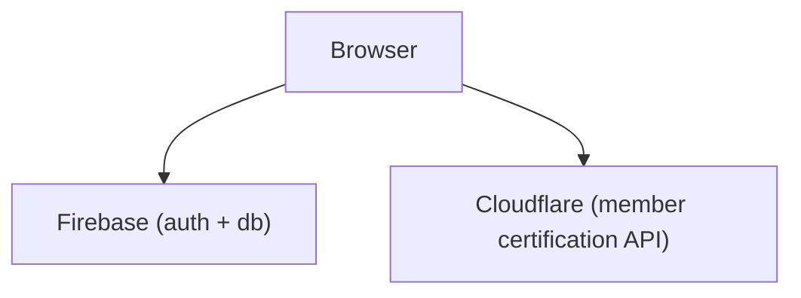

# FlightCard

An application for managing model rocketry launch events.

## Contributing

This project is open source under [ISC License](https://opensource.org/licenses/ISC).   Contributors are welcome.

### Architecture / Overview

FlightCard is a single-page web app (SPA), with the following architecture:

### Browser

The browser client is a single-page app (SPA), using TypeScript + React.  User authentication is handled using Google's [Firebase `auth` service](https://firebase.google.com/docs/auth).  All app data (launches, attendees, flightcards, etc...) is stored in the [Realtime Database()](https://firebase.google.com/docs/database).

The React components can be found in the `components` directory.

**Note**: Because this app uses the Realtime Database, changes to data are automatically synced cross *all* clients.  This, combined with the realtime React hooks (see `rt` directory) upon which most of the components are built, means that pretty much any change a user may make will appear immediately to all other users. (Cool, right?!?)

### Google Firebase

There's not a whole lot to say about this.  It's a data store with an API that allows clients to receive updates in realtime, which is a critical feature for an app like FlightCard, that is pretty much all about making sure people know what's going on in the flight range.

 Contributors will need to set up their own Firebase account and update the auth and db settings for the app accordingly... however we haven't yet worked through the process for doing this.  This will require copying the [security rules](https://github.com/broofa/flightcard/blob/main/rules.json) for the db, by the way.

 ### Cloudflare Worker

 Information about TRA and NAR member certifications (set in the user's profile page) is fetched from a small API implemented in a CloudFlare worker.  The code for this is in the `worker` directory.

Member cert information is actually cached in [CloudFlare's KV Store](https://developers.cloudflare.com/workers/runtime-apis/kv/).  The scripts used to initially seed the store are in `worker/src/publish_*`.  There is also a scheduled event in the worker itself (`worker/src/index.ts#schedule`) that keeps the KV store updated with any new changes to member information.  This runs once per day.  (I.e. It may take up to 24 hours for a member's information to be updated when it changes.)
