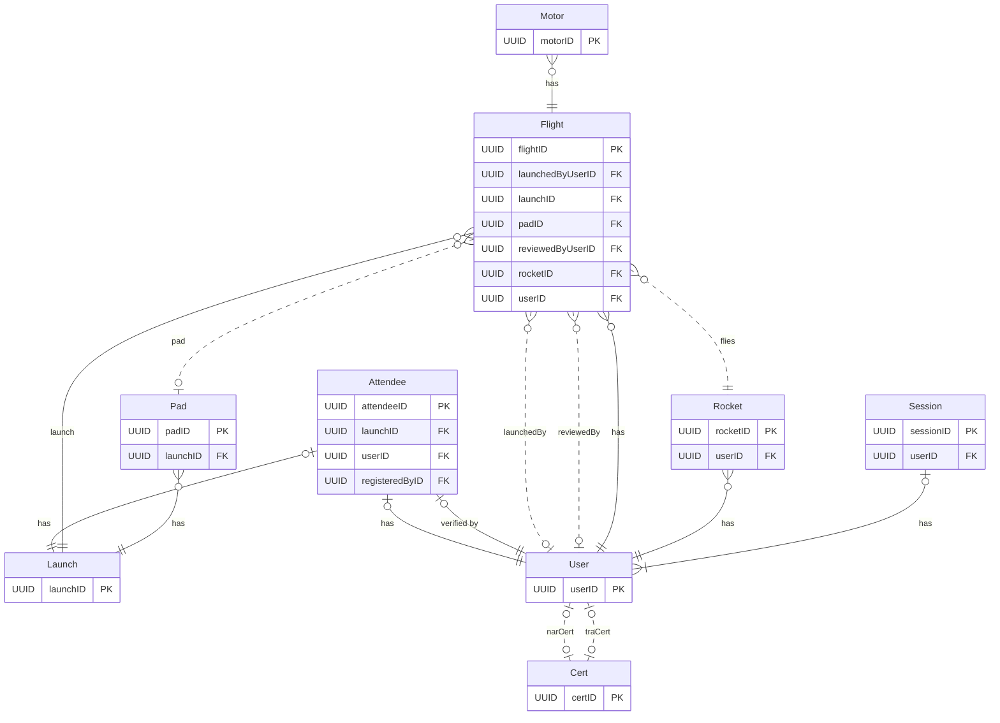

# FlightCard

An application for managing model rocketry launch events.

## Schema

```mermaid
erDiagram
  Attendee {
    UUID attendeeID PK

    UUID launchID FK
    UUID userID FK
    UUID registeredByID FK
  }

  Cert {
    UUID certID PK
  }

  Flight {
    UUID flightID PK

    UUID launchedByUserID FK
    UUID launchID FK
    UUID padID FK
    UUID reviewedByUserID FK
    UUID rocketID FK
    UUID userID FK
  }


  Launch {
    UUID launchID PK
  }

  Motor {
    UUID motorID PK
  }

  Pad {
    UUID padID PK

    UUID launchID FK
  }

  Rocket {
    UUID rocketID PK

    UUID userID FK
  }

  Session {
    UUID sessionID PK

    UUID userID FK
  }

  User {
    UUID userID PK
  }

  Attendee |o--|| User : has
  Attendee |o--|| User : "verified by"
  Attendee |o--|| Launch : has

  Flight }o--|| Launch : launch
  Flight }o..o| Pad : pad
  Flight }o..|| Rocket : flies
  Flight }o..o| User : launchedBy
  Flight }o..o| User : reviewedBy
  Flight }o--|| User : has

  Motor }o--|| Flight: has

  Pad }o--|| Launch : has

  Rocket }o--|| User : has

  Session |o--|{ User : has

  User |o..o| Cert : narCert
  User |o..o| Cert : traCert
```
## Contributing

This project is open source under [ISC License](https://opensource.org/licenses/ISC). Contributors are welcome.

### Dev Environment

You use VSCode, right?

(It's not _required_ but, boy, will it make your life easier. )